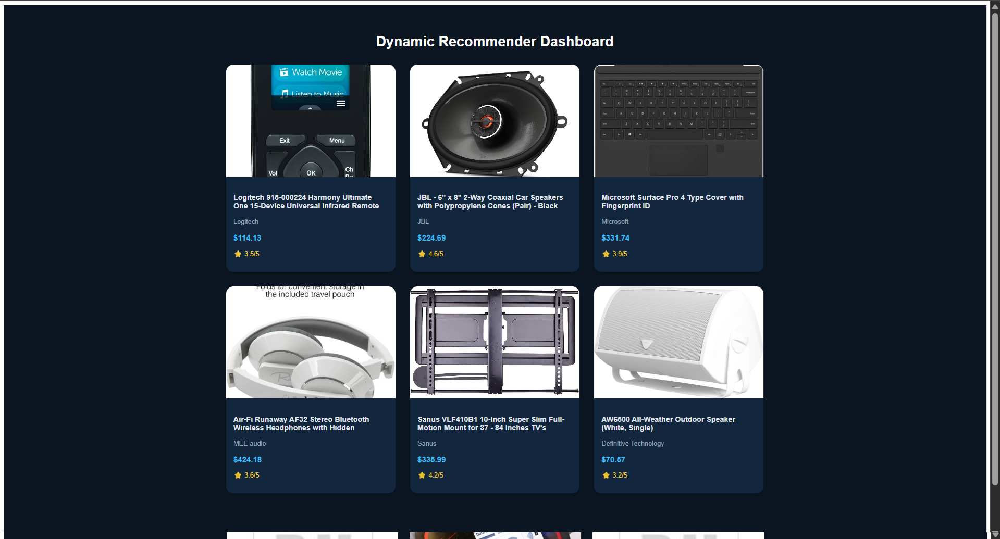

# 🧠 Dynamic Recommender

An intelligent AI-powered product recommendation system that uses content-based filtering and collaborative insights to suggest products users are likely to love.

Built using **FastAPI** (Backend) and **React + Vite** (Frontend) with **Snowflake** as the core data warehouse.

---

## 🚀 Features

✅ **Dynamic Product Recommendations** — Real-time recommendations powered by TF-IDF and Nearest Neighbors  
✅ **Content-Based Similarity** — Finds products similar in brand, category, and description  
✅ **Interactive UI** — Built with React (Dark Navy theme)  
✅ **Snowflake Integration** — Secure cloud database for all product and interaction data  
✅ **Randomized Price & Ratings** — For a realistic demo experience  
✅ **FastAPI Backend** — Lightweight, fast, and async-ready  

---

## 🧩 Tech Stack

| Layer | Technology |
|-------|------------|
| Frontend | React + Vite (Dark Navy Theme) |
| Backend | FastAPI |
| Database | Snowflake |
| ML Models | Scikit-learn (TF-IDF Vectorizer + NearestNeighbors) |
| Environment | Python 3.10+, Node.js 18+ |
| Hosting (Optional) | Render / Vercel / AWS EC2 |

---

## 🗂️ Project Structure

```
dynamic-recommender/
│
├── backend/
│   ├── main.py
│   ├── .env
│   ├── requirements.txt
│   └── ml/
│       ├── build_content_model.py
│       └── models/
│           ├── tfidf_vectorizer.joblib
│           ├── content_nn.joblib
│           └── product_index_map.joblib
│
└── frontend/
    ├── package.json
    ├── vite.config.js
    └── src/
        ├── App.jsx
        ├── pages/
        │   ├── Dashboard.jsx
        │   └── ProductDetails.jsx
        └── assets/
```

---

## ⚙️ Setup Instructions

### 1️⃣ Backend Setup

```bash
cd backend
pip install -r requirements.txt
```

Add your Snowflake credentials in `.env`:

```env
SNOWFLAKE_USER=your_username
SNOWFLAKE_PASSWORD=your_password
SNOWFLAKE_ACCOUNT=your_account
SNOWFLAKE_WAREHOUSE=COMPUTE_WH
SNOWFLAKE_DATABASE=DYNAMIC_RECOMMENDER_DB
SNOWFLAKE_SCHEMA=PUBLIC
```

Run the FastAPI server:

```bash
uvicorn main:app --reload
```

Your backend will start at:  
**http://127.0.0.1:8000**

---

### 2️⃣ Frontend Setup

```bash
cd frontend
npm install
npm run dev
```

Your frontend runs at:  
**http://localhost:5173**

---

## 🧠 How It Works

1. **Data Pipeline** — Product data is stored in Snowflake.
2. **Feature Extraction** — Text fields (title, brand, category) are vectorized using TF-IDF.
3. **Model Training** — NearestNeighbors identifies similar products based on cosine similarity.
4. **API Serving** — FastAPI serves recommendations and similarity results.
5. **UI Layer** — React displays results dynamically with randomized prices and ratings for realism.

---

## 🧑‍💻 Endpoints

| Endpoint | Description |
|----------|-------------|
| `/products` | Fetches list of available products |
| `/recommend/{user_id}` | Returns recommendations for a specific user |
| `/similar/{product_id}` | Returns top 6 similar products |

Test APIs interactively via:  
**http://127.0.0.1:8000/docs**

---

## 🧾 Example

**Product:** Logitech Z623 Speaker System

**Similar Recommendations:**
- Logitech Z625 400W
- Bose Companion 2 Series III
- Creative Pebble Plus

---

## 📸 UI Overview




| 🏠 **Dashboard** | Displays all products with price, rating, and image |
| 📦 **Product Details** | Shows selected product and three similar recommendations |

---

## 💡 Future Improvements

- Integrate ALS Collaborative Filtering
- Add user interaction tracking
- Enable real Snowflake ML model inference
- Deploy on Render/Vercel

---

## 👨‍💻 Author

**Rhythm Jigar Chheda**

🔗 [LinkedIn](https://www.linkedin.com/in/rhythm-chheda)  
📧 rhythmchheda@gmail.com


